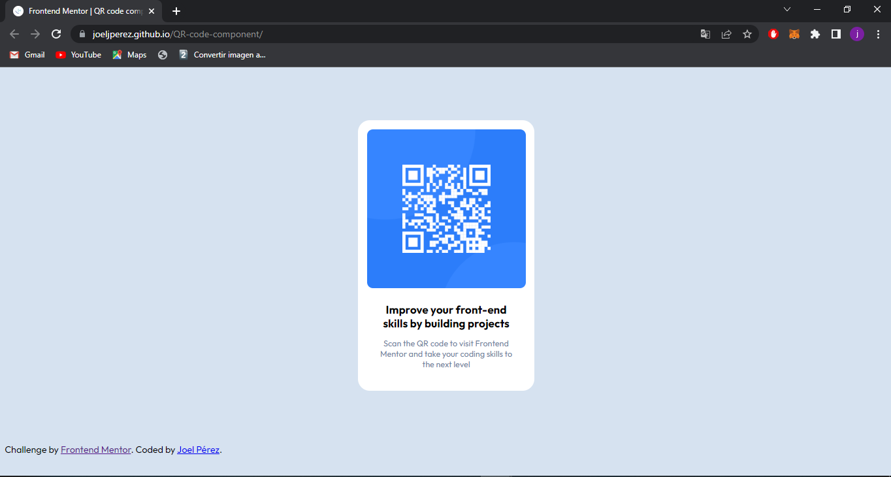

# Frontend Mentor - QR code component solution

This is a solution to the [QR code component challenge on Frontend Mentor](https://www.frontendmentor.io/challenges/qr-code-component-iux_sIO_H). Frontend Mentor challenges help you improve your coding skills by building realistic projects. 

## Table of contents

- [Overview](#overview)
  - [Screenshot](#screenshot)
  - [Links](#links)
- [My process](#my-process)
  - [Built with](#built-with)
  - [What I learned](#what-i-learned)
- [Author](#author)

## Overview

In this project, I have built a web page using HTML and CSS.

### Screenshot

### Links

- Solution URL: [Add solution URL here](https://github.com/JoelJPerez/QR-code-component)
- Live Site URL: [Add live site URL here](https://joeljperez.github.io/QR-code-component/)

## My process

### Built with

- HTML5: Used to structure the content of the web page.
- CSS3: Used to style and design the web page.

### What I learned

In this challenge, I was able to put HTML and CSS into practice and enhance my knowledge in using CSS styles.

## Author

- Frontend Mentor - [@JoelJPerez](https://www.frontendmentor.io/profile/JoelJPerez)

